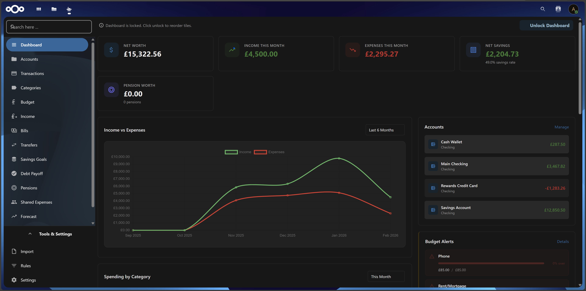

[](https://ko-fi.com/P5P31KQRF1)

# Nextcloud Budget

> ⚠️ **Beta**: This app is under active development. While stable, please backup your data regularly and [report any issues](https://github.com/otherworld-dev/Budget/issues) you encounter.

A comprehensive financial management app for Nextcloud. Track spending habits, manage multiple accounts, and forecast future balances through intelligent analysis of your financial history.



## What's New in v2.1.0

**Automation & Planning Release** - Advanced Rules, Bill Automation & Transfer Tracking
- **Advanced Rules Engine** - Visual query builder for complex boolean matching criteria with nested AND/OR/NOT ocoperators
- **Bills Calendar Report** - Annual overview showing which months bills are due with heatmap visualization
- **Recurring Transfers** - Track recurring transfers between accounts with auto-pay support
- **Auto-Pay Bills** - Automatically mark bills as paid when due date arrives with notifications
- **Future Bill Transactions** - Create future transactions for better cash flow planning
- **Dynamic Budget Periods** - Switch between weekly, monthly, quarterly, and yearly budgets with automatic pro-rating
- **Enhanced Net Worth Tracking** - Shows when last automatic snapshot was taken
- **Currency Symbol Fixes** - Correct positioning for suffix currencies (Swedish, Norwegian, Danish kronas, Swiss franc)
- **Bug Fixes** - Timezone date calculations, transaction filters, rule migrations, and more

See the [full changelog](budget/CHANGELOG.md) for details.

## Features

### Dashboard & Visualization
- **Customizable Dashboard** - Drag-and-drop tile reordering, lock/unlock dashboard editing
- **28 Dashboard Tiles** - Hero metrics, spending insights, forecasting, budget tracking, and more
- **Interactive Charts** - Cash flow forecasts, year-over-year comparisons, net worth history with Chart.js
- **Auto-Updating Tiles** - Dashboard refreshes automatically when transactions or budgets change

### Account & Transaction Management
- **Multi-Account Management** - Track bank accounts, credit cards, and cash across 20+ currencies
- **Transaction Tracking** - Add, edit, categorize, and search transactions with advanced filtering
- **Bulk Operations** - Delete, reconcile, or edit multiple transactions at once
- **Configurable Table Columns** - Show/hide columns to customize your transaction view
- **Split Transactions** - Allocate single transactions across multiple categories
- **Transaction Matching** - Automatic transfer detection and linking between accounts
- **Transfer Creation** - Create linked transfer transactions directly from transaction form

### Import & Automation
- **Smart Import** - Import bank statements from CSV, OFX, and QIF formats
  - Auto-detection of CSV delimiters (comma, semicolon, tab)
  - Dual-column amount mapping for separate income/expense columns
  - European number format support (1.234,56)
  - Automatic vendor matching and duplicate detection
- **Advanced Rules Engine** - Powerful auto-categorization with visual query builder
  - Complex boolean expressions with AND/OR/NOT operators
  - Nested criteria groups with unlimited depth
  - Multiple actions: category, vendor, notes, tags, account, type, reference
  - Preview matches before saving, run rules on existing transactions anytime
  - Priority-based execution with behavior settings (always, if_empty, append, merge)
- **Hierarchical Categories** - Organize spending with nested categories and drag-and-drop reordering
- **Tag Sets** - Multi-dimensional transaction categorization with custom tag sets per category

### Budgeting & Planning
- **Budget Tracking** - Set spending limits by category with alerts when approaching or exceeding budgets
  - Dynamic period switching (weekly, monthly, quarterly, yearly)
  - Automatic pro-rating when changing budget periods
  - Real-time progress tracking with visual indicators
- **Balance Forecasting** - Predict future balances using trend analysis and scenario modeling
- **Recurring Bills** - Detect and track recurring payments
  - Auto-pay option to automatically mark bills as paid on due date
  - Create future transactions for cash flow planning
  - Bill reminders via Nextcloud notifications
  - Custom frequency patterns (select specific months for irregular bills)
- **Bills Calendar** - Annual overview showing which months bills are due
  - Interactive heatmap visualization
  - Monthly totals with bar chart
  - Filter by status and include/exclude transfers
- **Recurring Income** - Track expected income sources (salary, dividends, etc.) with receipt tracking
- **Recurring Transfers** - Track and automate transfers between accounts
  - Monthly equivalent calculations for different frequencies
  - Integration with bills system for unified tracking

### Debt & Goals
- **Debt Payoff Planner** - Plan debt repayment using avalanche or snowball strategies
- **Savings Goals** - Set financial targets with progress tracking and achievement forecasting
- **Pension Tracker** - Track retirement accounts with growth projections and combined forecasts

### Sharing & Collaboration
- **Shared Expenses** - Share expenses with roommates, partners, or friends and track who owes whom
  - Settlement tracking with payment history
  - Contact integration with Nextcloud

### Reporting & Analysis
- **Net Worth History** - Track assets and liabilities over time with interactive charts
  - Daily automatic snapshots with manual recording option
  - Status indicators showing last snapshot timing
- **Bills Calendar** - Visualize when bills are due throughout the year
- **Year-over-Year Reports** - Compare spending across multiple years side-by-side
- **Reports & Charts** - Visualize spending patterns, income, and cash flow over time

### Security & Data Management
- **Password Protection** - Optional secondary password layer for enhanced app security
  - Session management with configurable timeout (15/30/60 minutes)
  - Auto-lock on inactivity with manual lock option
  - Failed attempt protection (5 attempts = 5-minute lockout)
- **Data Export/Import** - Full data migration support for moving between Nextcloud instances
- **Factory Reset** - Restore app to empty state with one-click data deletion (preserves audit logs)
- **Audit Logging** - Complete trail of all financial actions

## Requirements

- Nextcloud 30 - 32
- PHP 8.1+
- MySQL/MariaDB, PostgreSQL, or SQLite

## Installation

### From App Store (Recommended)

1. Log in to your Nextcloud instance as admin
2. Go to **Apps** > **Office & text**
3. Search for "Budget"
4. Click **Download and enable**

### Manual Installation

```bash
cd /path/to/nextcloud/apps
git clone https://github.com/otherworld-dev/Budget.git budget
cd budget/budget

# Install dependencies
composer install --no-dev --optimize-autoloader
npm install

# Build frontend
npm run build
```

Enable the app:

```bash
php occ app:enable budget
```

## Development

### Setup Development Environment

```bash
cd /path/to/nextcloud/apps
git clone https://github.com/otherworld-dev/Budget.git budget
cd budget/budget

# Install all dependencies
composer install
npm install

# Build for development
npm run dev

# Watch for changes
npm run watch
```

### Build Commands

| Command | Description |
|---------|-------------|
| `npm run build` | Production build |
| `npm run dev` | Development build with source maps |
| `npm run watch` | Auto-rebuild on file changes |
| `npm run lint` | Run ESLint |
| `npm run lint:fix` | Auto-fix linting issues |

### Project Structure

```
budget/
├── appinfo/           # App metadata and routing
├── lib/
│   ├── Controller/    # API endpoints
│   ├── Service/       # Business logic
│   ├── Db/            # Database models and mappers
│   ├── Enum/          # Type definitions
│   └── Migration/     # Database schema versions
├── src/               # Frontend source (ES6+)
│   ├── modules/       # Feature-based modules (14 modules)
│   ├── core/          # Router and infrastructure
│   ├── utils/         # Shared utilities
│   └── config/        # Dashboard widgets configuration
├── js/                # Compiled JavaScript
├── css/               # Compiled styles
├── templates/         # PHP templates
└── tests/             # PHPUnit test suites
```

## Usage

### Getting Started

1. **Add Accounts** - Navigate to the Accounts section and add your bank accounts
2. **Import Transactions** - Use the Import feature to upload your bank statements
3. **Set Up Categories** - Create categories that match your spending patterns
4. **Configure Import Rules** - Set up rules to automatically categorize future imports
5. **Track Bills** - Add recurring bills to monitor upcoming payments
6. **Set Goals** - Create savings goals to track progress toward financial targets

### Importing Bank Statements

The app supports the following formats:
- **CSV** - Most banks provide CSV exports (supports European formats)
- **OFX** - Open Financial Exchange format
- **QIF** - Quicken Interchange Format

#### CSV Import Tips

1. The first row should contain column headers
2. Common columns: Date, Description, Amount, Balance
3. Use the column mapping feature to match your bank's format
4. For European banks with separate income/expense columns, use dual-column amount mapping
5. The app auto-detects delimiters (comma, semicolon, tab)

### Setting Up Import Rules

The advanced rules engine uses a visual query builder for complex patterns:

1. Go to **Rules** in the navigation menu
2. Click **Add Rule**
3. Build criteria using the visual query builder:
   - Add conditions (field, match type, pattern)
   - Group conditions with AND/OR operators
   - Use NOT operator for negation
   - Create nested groups for complex logic
4. Configure actions (category, vendor, notes, etc.)
5. Set priority and behavior (always, if_empty, append, merge)
6. **Preview** to test matches before saving
7. **Run Now** to apply to existing transactions

### Bills and Transfers

**Bills:**
- Add recurring bills with custom frequency patterns
- Enable auto-pay to automatically mark bills as paid on due date
- Create future transactions for cash flow planning
- View annual bills calendar to see when bills are due throughout the year

**Transfers:**
- Track recurring transfers between accounts (e.g., monthly savings transfers)
- Enable auto-pay for automatic execution
- Set transaction description patterns for import matching

### Forecasting

The forecast feature analyzes historical spending to predict future balances:

1. Select the account(s) to forecast
2. Choose the historical period to analyze (3, 6, or 12 months)
3. Select the forecast horizon
4. Generate the forecast

The forecast considers:
- Regular income patterns
- Recurring expenses
- Seasonal variations
- Average spending by category

### Data Migration

To move your data between Nextcloud instances:

1. **Export** - Go to Settings > Data Migration > Export to download all your data
2. **Import** - On the new instance, go to Settings > Data Migration > Import and upload the export file

## API

The app provides a REST API for all functionality:

| Endpoint | Description |
|----------|-------------|
| `/api/accounts` | Account management |
| `/api/transactions` | Transaction CRUD and search |
| `/api/categories` | Category hierarchy |
| `/api/tag-sets` | Tag set management |
| `/api/import` | Bank statement import |
| `/api/import-rules` | Advanced auto-categorization rules |
| `/api/forecast` | Balance predictions |
| `/api/bills` | Recurring bill tracking with auto-pay |
| `/api/transfers` | Recurring transfers between accounts |
| `/api/goals` | Savings goal management |
| `/api/pensions` | Pension account tracking |
| `/api/reports` | Financial reports |
| `/api/migration` | Data export/import |
| `/api/auth` | Password protection |

## Troubleshooting

### Import fails with "Invalid format"

- Ensure your CSV has headers in the first row
- Check that date format matches your locale settings
- Verify the file encoding is UTF-8
- For European formats, the app will auto-detect delimiters and number formats

### Transactions not categorizing automatically

- Check that import rules are active
- Use the **Preview** feature to test rule matching before saving
- Verify rule patterns match transaction descriptions
- Review rule priority order (higher priority rules execute first)

### Forecast seems inaccurate

- Ensure you have at least 3 months of transaction history
- Check for unusual one-time transactions that might skew averages
- Verify all regular transactions are properly categorized

### Categories page is blank

- Verify categories were imported successfully via Settings > Data Migration
- Check browser console for JavaScript errors
- Try refreshing browser cache (Ctrl+F5 / Cmd+Shift+R)

## Contributing

Contributions are welcome! Please:

1. Fork the repository
2. Create a feature branch (`git checkout -b feature/my-feature`)
3. Make your changes
4. Run tests (`make test`) and linting (`make lint`)
5. Submit a pull request

## License

This project is licensed under the **AGPL-3.0-or-later** license.

## Support

- **Issues**: [GitHub Issues](https://github.com/otherworld-dev/Budget/issues)
- **Discussions**: [GitHub Discussions](https://github.com/otherworld-dev/Budget/discussions)
- **Forum**: [Nextcloud Community](https://help.nextcloud.com)
