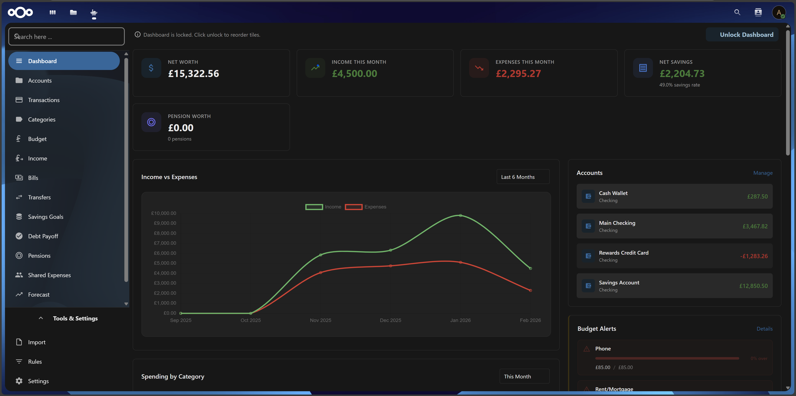

# Nextcloud Budget

> ⚠️ **Beta**: This app is under active development. While stable, please backup your data regularly and [report any issues](https://github.com/otherworld-dev/Budget/issues) you encounter.

Budget is a personal finance app for Nextcloud. It keeps your bank accounts, credit cards, loans and pensions in one place, imports the statements your bank gives you, tracks spending against a budget and forecasts where your balances are heading, with all of the data staying on your own server.

## What it does

- Accounts and transactions in over 45 currencies, with splits, tags, transfers and statement reconciliation
- Statement import from CSV, OFX, QIF and camt.053 XML, rules that categorise transactions for you, and bank sync through GoCardless or SimpleFIN
- Category budgets (including envelope budgets that roll over), bills, recurring income and balance forecasts
- Savings goals, debt payoff plans, assets, pensions and net worth history
- Reports with PDF export, and a dashboard you can arrange yourself
- Sharing accounts and budgets with other Nextcloud users, and splitting expenses with contacts
- Nextcloud dashboard widgets, unified search and a calendar feed for your bills
- A [public API](https://budget.otherworld.dev/docs/api.html) for scripts and automation, which the Budget Companion Android app (in development) also uses

Every feature is explained in the [documentation](https://budget.otherworld.dev/docs/), and the [changelog](budget/CHANGELOG.md) lists what has changed in each release.

## Installation

Budget needs Nextcloud 30 to 35 and PHP 8.1 or later with the BCMath extension, and works with MySQL/MariaDB, PostgreSQL or SQLite.

The simplest way to install it is from the Nextcloud App Store: log in as an admin, go to **Apps**, search for "Budget" and click **Download and enable**. To install from a release tarball or from source instead, see [INSTALL.md](INSTALL.md).

Once it is enabled, the [getting started guide](https://budget.otherworld.dev/docs/getting-started.html) takes you through adding your first account and importing a statement.

## Translations

Translations are managed on [Weblate](https://hosted.weblate.org/projects/nextcloud-budget/), where you can translate in the browser without touching any code and your work is merged into the app automatically. Strings containing `{placeholders}` (e.g. `{amount}`) must keep the placeholder names exactly as they are. If you would rather work with `.po` files, see the [translation guide](budget/translationfiles/README.md).

## Contributing

Bug reports and feature requests go in [GitHub Issues](https://github.com/otherworld-dev/Budget/issues), and questions in [Discussions](https://github.com/otherworld-dev/Budget/discussions). For code changes, fork the repository, work on a branch from `dev`, and run `make test` and `make lint` in `budget/` before opening a pull request. [INSTALL.md](INSTALL.md#development-setup) covers setting up a development copy.

## Support the project

Budget is free and open source, and built and maintained in spare time. If it is useful to you, especially if it replaced a paid finance service, you can support development through [GitHub Sponsors](https://github.com/sponsors/otherworld-dev) (monthly or one-time) or [PayPal](https://www.paypal.com/donate/?hosted_button_id=MA56N6K8FSTQ2).

## Acknowledgements

This app is shaped by the people who report bugs, suggest features and translate it:

- **[@SGiersch](https://github.com/SGiersch)**: dozens of bug reports, feature discussions, and the German translation
- **[@TerjeTM](https://github.com/TerjeTM)**: thorough testing and detailed bug reports that led to major improvements in the bills system and data repair tools
- **[@JaviAZ](https://github.com/JaviAZ)**: code contributions and bug reports around category spending and transfers
- **[@jumaxotl](https://github.com/jumaxotl)**: the complete French translation
- **[@H2Oufoe](https://github.com/H2Oufoe)**: extensive bug reporting and testing across multiple releases
- **[@st33vil](https://github.com/st33vil)**: found the pagination balance calculation bug
- **[@T0mFi](https://github.com/T0mFi)** and **Pavel Borecki**: the Czech translation
- **[@raduberbece](https://github.com/raduberbece)**, **[@MrTCAJ](https://github.com/MrTCAJ)** and **[@mschur](https://github.com/mschur)**: bug reports and feedback

## Licence

Budget is licensed under the **AGPL-3.0-or-later** licence.
